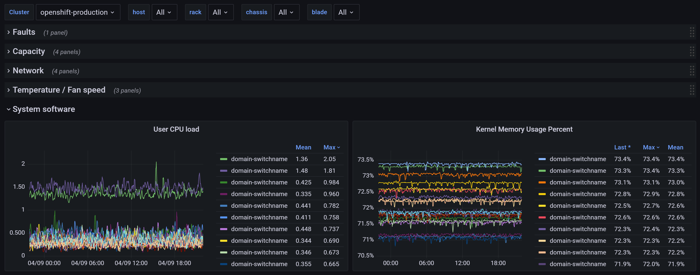

# prometheus-ucs-exporter

## Overview

Use metrics from the UCS API to export relevant metrics to Prometheus

This repository is a fork of Drew Stinnett's original exporter at
[oit-ssi-systems/prometheus-ucs-exporter][original].

Modifications made include:
* Added production server (FastAPI)
* Added additional metrics
* Added Grafana dashboard
* Minor fixes and refactorings

[original]: https://gitlab.oit.duke.edu/oit-ssi-systems/prometheus-ucs-exporter

Install the Grafana dashboard by importing the JSON file `grafana/dashboard.json`.



## Installation

Build and run with Docker:

```
docker build -t prometheus-ucs-exporter .

docker run -p 3001:3001 -e PORT=3001 \
-e PROM_UCS_USERNAME='ucs-mydomain\username' \
-e PROM_UCS_PASSWORD='passw0rd' \
prometheus-ucs-exporter
```

Fetch metrics:

```
curl http://localhost:3001/metrics?domain=my-domain.example.com
```

> Note: Metrics are fetched in a background worker after an initial scrape,
> since UCSM can be slow to respond.
> Continue polling the `/metrics` endpoint until metrics are returned.